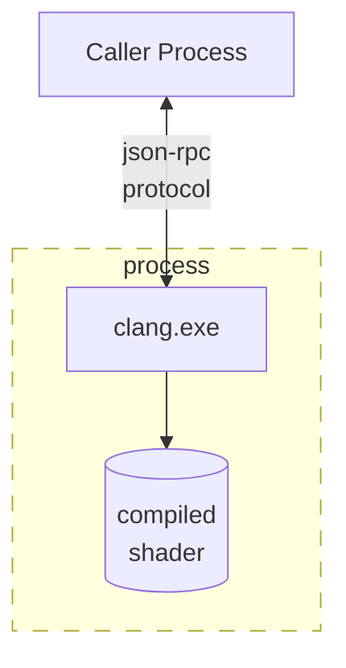
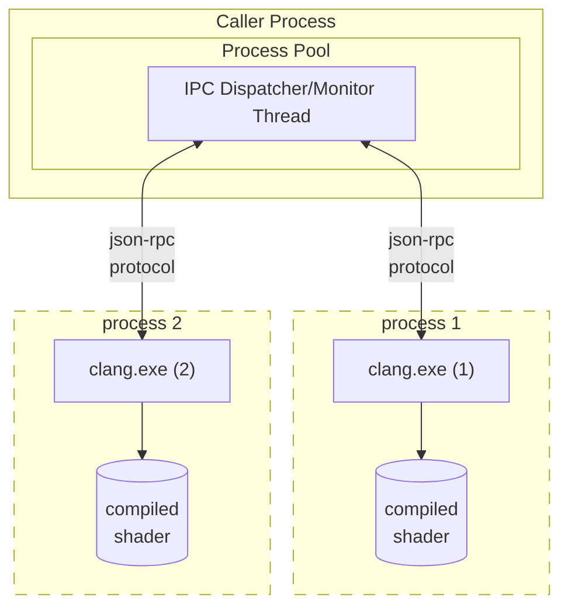

<!--  -->

# Out-of-process compiler api architecture

* Proposal: [0012](0012-outofproc-compiler-api-architecture.md)
* Author(s): [Cooper Partin](https://github.com/coopp)
* Sponsor: [Cooper Partin](https://github.com/coopp)
* Status: **Under Consideration**
* Impacted Project(s): (Clang)

* Issues:

## Introduction

An effort is underway to bring compilation support into clang for HLSL based
shaders.  A C style api will be built to enable applications to compile
a shader from their own processes in addition to being able to launching the
clang process.

This document is to propose a more detailed architecture for the approved 
[proposal 0005](0005-inproc-outofproc-compiler-api-support.md).

The C API [proposal 0008](0008-c-interface-compiler-library.md) for compiling
a shader will be built using this out of process architecture.

## Motivation

* Security is a concern when compiling a shader in a process space that is
considered protected.  An out of process design would move that concern to an
isolated process.

* Running multiple instances of clang In-process across multiple threads has
known thread-safety concerns for the clang compiler. The clang compiler holds
some state at compile time and some of that state could leak to other
compilation sessions if it is not protected.

* Cleanup between compiler invocations. Destroying a process and bringing it
back up ensures that any state leaked or leftover from a previous compilation
will be cleaned up.

* Handling of catastrophic errors avoids taking down the calling process. The
clang compiler is known to abort in certain conditions which would take down
a process if they hosted the compiler in-process. The worker process will be
taken down not the application with an out-of-process design.

## Proposed solution

The architecture for this out of process design will take advantage of systems
that have multiple processors, or multiple-core processors. 

Each process that uses the C API has a single process pool that is shared
between all instances of the API that process creates.

Each process in the pool is an instance of a clang compiler running in a
special server mode that uses a named pipe IPC and a
[json-rpc protocol](#ipc-communication-data) to communicate.

## Detailed design

### clang compiler with IPC to communicate with a calling process
The following diagram shows a single process communicating with a clang
compiler instance. 

This is very similar to how [clangd](https://clangd.llvm.org/) communicates.  

Extending clangd to support this compilation architecture design was considered
but abandoned because clangd is more focused on working directly with the AST.
The clangd process is long lived and designed to support editor integration
scenarios like syntax highlighting and code completion. This design is focused
on single compilation and short lived compiler process instances.

Existing and well tested support code used to build clangd in the llvm source
repo will be leveraged as appropriate.



### Process Pool manages multiple clang compiler instances
The following diagram shows a process pool managing more than one instance of
a clang compiler. As mentioned above, Each process that uses the C API has a
single process pool that is shared between all instances of the API that
process creates. A separate compiler process for each available processor.
For example, if the system has four processors, then four compiler processes
are created.

A compiler process exits after every compilation. This ensures every compilation
starts with clean compiler state. The pool is responsible for back filling
processes that have exited ensuring the pool size is maintained.



### Error handling

If the compiler encounters an error during compilation or the compiler
process crashes, the rest of the compiler processes will continue on.
Error information is communicated back over the IPC mechanism to the caller
and the application will choose how to handle it.

### IPC communication data

A JSON message-based protocol [json-rpc](https://www.jsonrpc.org/specification)
is used for packaging parameters and communicating with other processes.
This protocol provides the most flexibility for implementing apis over an IPC
mechanism. Existing clang tooling (clangd) already use json-rpc and have some
code that could be leveraged/shared for this implementation.

A `Requst`/`Response` pair is matched to a single API call. A `Response`
type indicates if the API call was successful or not.

The Client (**caller process**) is typically defined as the origin of `Request`
objects and the handler of `Response` objects.

The Server (**clang process**) is typically defined as the origin of `Response`
objects and the handler of `Request` objects.

Both Clients and Servers can issue `Request`/`Response` pairs if required.
(see [include handler support](#include-handler-support)).

### JSON-RPC messages (generic)

#### JSON Request
```json
{
    "json-rpc":"2.0",
    "method":"methodname",
    "params":{ "arg":"value",  "arg2":"value2", "arg3":"value3" },
    "id":1
}
```
#### JSON Response (success) - contains result data
```json
{
    "json-rpc":"2.0",
    "result":{ "res":"value" },
    "id":1
}
```
#### JSON Response (error) - contains error code
```json
{
    "jsonrpc": "2.0",
     "error": {"code": -32601, "message": "Method not found"},
     "id": 1
}
```

### Protocol communication with example JSON-RPC messages
A simple compilation with no include handler callback provided will be
implemented as a single `Request` followed by a single `Response`.

```
Syntax for describing Request/Response pairs:
--> data sent to server
<-- data coming from server
```

```
---> REQUEST  id:1 compile...
<--- RESPONSE id:1 compile succeeded/failed
```

STDOUT and STDERR will be captured and sent back with every completed
compilation `Response`.  This ensures that the caller can see any additional
information about the compile operation.

STDOUT/STDERR will be returned in one of two forms determined by the caller.
* A path to a file that contains the captured output. The caller is responsible
for cleaning up this file after being accessed.
* A serialized object that contains the contents of the captured output.
> TBD: Is the serialized object a compressed buffer of the full contents or
a stream object where the caller can read from?

### Example: compile, no include handler, success
```
---> REQUEST           id:1 compile...
<--- RESPONSE (result) id:1 compile succeeded

(RPC-JSON example)

--> {"jsonrpc": "2.0", "method": "compile",
     "params": {"arg1": 23, "arg2": 42}, "id": 1}

<-- {"jsonrpc": "2.0", "result": {"stdout": "somepath", "stderr": "somepath"},
     "id": 1}
```

### Example: compile, no include handler, failure
```
---> REQUEST          id:1 compile...
<--- RESPONSE (error) id:1 compile failed

(RPC-JSON example)

--> {"jsonrpc": "2.0", "method": "compile",
     "params": {"arg1": 23, "arg2": 42}, "id": 1}

<-- {"jsonrpc": "2.0", "error": {"code": -2, "message": "compile failed"},
     "data": {"stdout": "somepath", "stderr": "somepath"}, "id": 1}
```

### Include handler support
Include handlers add some additional complexity but still keep to the
`Request`/`Response` pair design.  If an include handler callback is provided
to the c api, a special proxy implementation of that callback is created and 
connected to the IPC messaging system and lives in the clang.exe process.
This proxy callback will be used during compilation when an include is
required. Calling the proxy callback results in an IPC communication with
the client's dispatcher in the form of a `Request`/`Response` pair asking for a 
buffer for the specified include.

```
---> REQUEST  id:1 compile...

(server to client communication)
<--- REQUEST  id:2 need include...
---> RESPONSE id:2 include result
<--- REQUEST  id:3 need include...
---> RESPONSE id:3 include result

<--- RESPONSE id:1 compilation result
```

### The clang server process
The compiler driver code for DXC lives in clang.exe.  This module will be
extended with additional command-line arguments and launch behaviors.
Additional params will be used to configure the process startup logic to setup
the required IPC for communicating back to the thread that launched it.

Using this same module keeps a single shipping binary for all compilation.

## Acknowledgments

[Chris Bieneman](https://github.com/llvm-beanz)

<!--  -->

