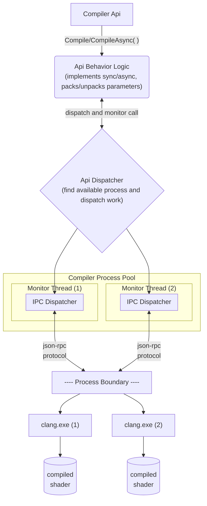

<!--  -->

# Out-of-process compiler api architecture

* Proposal: [NNNN](NNNN-outofproc-compiler-api-architecture.md)
* Author(s): [Cooper Partin](https://github.com/coopp)
* Sponsor: [Cooper Partin](https://github.com/coopp)
* Status: **Under Consideration**
* Impacted Project(s): (Clang)

* Issues:

## Introduction

An effort is underway to bring compilation support into clang for HLSL based
shaders.  A C style api will be built to enable applications to compile
a shader from their own processes in addition to being able to launching the
clang process.

This document is to propose a more detailed architecture for the approved 
proposal: [0005](0005-inproc-outofproc-compiler-api-support.md).

The c api [0008](0008-c-interface-compiler-library.md) for compiling a shader
will be implemented using this out of process architecture.

## Proposed solution

The architecture for an out of process design will behave in a similar way to
the MSBuild design. The system functions as a Process Pool.  This allows the
compilation work to take advantage of systems that have multiple processors, or
multiple-core processors. A separate compiler process is created for each
available processor. For example, if the system has four processors, then four
compiler processes are created.

The process pool is owned by a singleton object and shared between each api
instance created in the calling process. Compilation Requests are blocking
calls followed by a single Response.

The c api implementation built on top of this architecture implements any 
required synchrounous and asynchrous api behaviors. The c api call will be
blocked either waiting for a worker process to become available or an already
dispatched work to be completed. This behavior depends on the type of call
used (synchronous/asynchronous).

Communication with the process pool occurs in-process to the application
and the pool's monitoring threads use a named pipe IPC mechanism with a
protocol to communicate with each monitored clang process.

## Detailed design

### Out-of-process system initialization

On first creation of a compiler api instance, a singleton object is created
in-process to the caller.

The singleton object manages all state and request traffic from the calling
process. The singleton contains an api dispatching system that interfaces with
a process pool. Each worker process in the pool is monitored by a dedicated
thread. One thread to one process.

Worker monitoring threads use named pipes as IPC to communicate with their
workers and a different method (TBD) to communicate with the singleton's
api dispatching system.

Worker processes exit unconditionally after completing work. The monitoring
thread spawns a new process for any exited process to replenish the process
pool. Exited processes include crashed processes.  Processes that crash are
detected by the monitoring thread allowing error information to be communicated
back through the system.

The worker process (Clang.exe) will be updated to include additional command
options that indicate it should be launched as a worker and establish the IPC
mechanism with a monitoring thread owned by the Compiler Process Pool.

## Architecture Diagram


### Calling apis
Compiler instances are required inputs to compiler api calls. This ensures that
the work being performed is associated to an instance.

The api call begins in the api entrypoint implementation which calls into some
logic that implements sync/async behaviors. This Api Behvaior logic packages
the call with parameters and works with the the Api Dispatcher to find an
available worker process (clang.exe) to perform the work.  If a worker is not 
available the Api Behavior logic will queue the compilation and block the
entrypoint for synchronous calls waiting for the next available worker to be
freed up or for Asynchronous calls return immediately giving the caller enough
context to monitor or cancel the compilation.

The api implementation, dispatcher and process pool all live in-process to
the calling application.

The dispatching system uses IPC and a message protocal to communicate with
each worker process.

### Roles in the system

#### The API entrypoint

* Package api parameters into the required messsage format
* Send a message with params to the Api call dispatcher
* Wait for completion/implements api call behaviors
* Unpack results
* Return results

#### The API call Dispatcher

* Find/Wait for an open worker process by calling into the Process Pool
* Send a message with params to the Process pool to be picked up by a worker
  monitoring thread which will dispatch the work to a clang process.
* Wait for completion
* Return results to the API entrypoint

#### The Process Pool (worker process monitoring thread)

* Send a message with params to its monitored worker process over IPC
* Wait for completion
* Return results to the api call dispatcher
* Spawn a new worker process

#### The Worker Process (clang.exe)

* Unpack the message and params from its monitoring thread and call into a
 compiler implementation.
* Wait for completion
* Exit process cleanly / or crash
    * In both cases, the process will be exited. The monitoring thread will
    always ensure that the contents of the stdout/stderr data is sent back to
    the caller.

### Error handling

If the compiler encounters an error during compilation or the compiler
process crashes, the rest of the compiler processes will continue on.
Error information is communicated back over the IPC mechanism to the caller
and the application will choose how to handle it.

### IPC communication data

A JSON message-based protocol [json-rpc](https://www.jsonrpc.org/specification)
is used for packaging parameters and communicating with other processes.
This protocol provides the most flexiblity for implementing apis over an IPC
mechanism. Existing clang tooling (clangd) already use json-rpc and have some
code that could be leveraged/shared for this implementation.

Large amounts of data will be communicated as file paths to files containing
their contents. This reduces the need to have a complex marshalling layer or
deal with the management of a shared memory system.

The following examples for compilation show stdout and stderr being captured
as a file and their paths being returned.
```
TODO: Figure out the lifetime of these files.  How will they get cleaned up or
      will they just become allocations in-process to the caller to return via
      the c api as buffers.
```

### JSON-RPC messages (generic)

#### JSON Request
```json
{
    "json-rpc":"2.0",
    "method":"methodname",
    "params":{ "arg":"value",  "arg2":"value2", "arg3":"value3" },
    "id":1
}
```
#### JSON Response (success) - contains result data
```json
{
    "json-rpc":"2.0",
    "result":{ "res":"value" },
    "id":1
}
```
#### JSON Response (error) - contains error code
```json
{
    "jsonrpc": "2.0",
     "error": {"code": -32601, "message": "Method not found"},
     "id": 1
}
```

### Protocol communication with example JSON-RPC messages
A simple compilation with no include handler callback provided will be
implemented as a single `Request` followed by a single `Response`.

```
REQUEST  - "compile"
RESPONSE - "result", compilation succeeded/failed.
```

```
Syntax:
--> data sent to server
<-- data coming from server
```

### Example: compile, no include handler, success
```
--> {"jsonrpc": "2.0", "method": "compile",
     "params": {"arg1": 23, "arg2": 42}, "id": 1}

<-- {"jsonrpc": "2.0", "result": {"stdout": "somepath", "stderr": "somepath"},
     "id": 1}
```

### Example: compile, no include handler, failure
```
--> {"jsonrpc": "2.0", "method": "compile",
     "params": {"arg1": 23, "arg2": 42}, "id": 1}

<-- {"jsonrpc": "2.0", "error": {"code": -2, "message": "compile failed"},
     "data": {"stdout": "somepath", "stderr": "somepath"}, "id": 1}
```

Include handlers add some additional complexity but still keep to the
`Request`/`Reponse` pair design.  If an include handler callback is provided
to the c api, a special proxy implementaiton of that callback is created and 
connected to the IPC messaging system and lives in the clang.exe process.
This proxy callback will be used during compilation when an include is
requested.  Calling the proxy callback will result in IPC communication with
the Api Dispatcher in the form of a `Response` indicating an include is needed.

A compilation is started using a single "compile" `Request` and additional state
is provided that indicates include handler support is available.

Compilation proceeds and blocks the originating `Request` until the first need
an include handler is encountered. The proxy callback is called as the include
handler and the implementation sends a `Response` back to the Api Dispatcher
indicating that include handler information is needed. This will close the
originating "compile" `Request`/`Response` pair.

The Api Dispatcher code (in the caller's process) sees this `Response` and
immediately calls the c api provided include handler callback. The results are
collected and new "continue compilation" `Request` is dispatched.

The worker process (currently waiting for another `Request` to continue)
recieves the `Request` with include handler data as parameters and proceeds
with compilation.

This `Request`/`Response` pattern continues until the compilation is completed.
Compilation is always concluded with a final `Response` closing the
`Request`/`Response` pair.

```
REQUEST  - "compile" (include handler support is enabled)

( compiler needs an include, calls IPC wrapped included handler callback )

RESPONSE - "needinclude"

( originating caller's callback gets called and results are collected and
passed into a new request to continue compilation )

REQUEST - "continuecompile" (include handler result passed as params)
RESPONSE - "needinclude"

( originating caller's callback gets called and results are collected and
passed into a new request to continue compilation )

REQUEST  - "continuecompile"

( no more includes are encountered and compilation reaches the end )

RESPONSE - "result", compilation succeeded/failed.
```

The following is a JSON-RPC example of this pattern.

### Example: compile, include handler, success
```
**** start compilation ****
--> {"jsonrpc": "2.0", "method": "compile", "params": {"arg1": 23, "arg2": 42},
     "includehandler", "true", "id": 1}

**** include needed, so response indicates this and supplies a path ****
<-- {"jsonrpc": "2.0", "result": {"needinclude": "true", "path": "somepath"}, "id": 1}

**** continue compilation, supplying include data ****
--> {"jsonrpc": "2.0", "method": "continuecompile", "params": {"path": "somepath"}, "id": 2}

**** include needed, so response indicates this and supplies a path ****
<-- {"jsonrpc": "2.0", "result": {"needinclude": "true", "path": "somepath2"}, "id": 2}

**** continue compilation, supplying include data ****
--> {"jsonrpc": "2.0", "method": "continuecompile", "params": {"path": "somepath"}, "id": 3}

**** compilation completed ***
<-- {"jsonrpc": "2.0", "result": {"stdout": "somepath", "stderr": "somepath"},
     "id": 3}
```

### The worker process
The compiler driver code for DXC lives in clang.exe.  This module will be
extended with additional commandline arguments and launch behaviors.
Additional params will be used to configure the process startup logic to setup
the required IPC for communicating back to the thread that launched it.

Using this same module keeps a single shipping binary for all compilation.

## Alternatives considered

> Caller creates a factory object first and uses that to create compiler
instances.

## Acknowledgments

[Chris Bieneman](https://github.com/llvm-beanz)

<!--  -->

